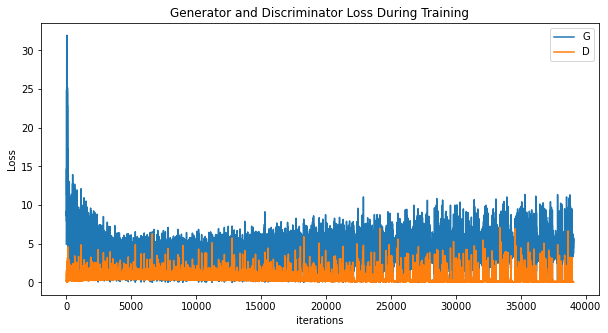

# GAN for Face Image Generation

This repository contains the implementation of a Generative Adversarial Network (GAN) designed to generate face images similar to those found in the CelebA dataset. The project is implemented using PyTorch and is based on the Deep Convolutional GAN (DCGAN) architecture.

## Overview

The project demonstrates the power of GANs in generating realistic images from random noise. By training a Generator to create images and a Discriminator to distinguish between real and generated images, the GAN iteratively improves the quality of the generated images. The CelebA dataset, known for its wide variety of face images, serves as the training data, making the GAN capable of producing diverse and realistic facial images.

## Repository Structure

- **GAN_celeba.py**: The primary script that handles model training, testing, and image generation.
- **data**: Download the celeba data from the website.
- **outputs/**: Generated images are on root direc.
- **probability distribution**: Includes 15 probability distribution images comparing real data to generated data.
- **requirements.txt**: List of required Python packages for running the project.
- **README.md**: This file, providing detailed information about the project.

## Prerequisites

Before running the code, ensure you have the following installed:

- Python 3.8 or higher
- PyTorch 1.9.0 or higher
- Torchvision 0.10.0 or higher
- Numpy
- Matplotlib
- Seaborn

## Dataset
The CelebA dataset is used for training. It contains over 200,000 celebrity images with various attributes.

## Models

### Generator
The Generator is responsible for creating images from random noise. It consists of transposed convolutional layers with batch normalization and ReLU activations. The final output is processed through a Tanh activation function to scale the pixel values to the range [-1, 1].

### Discriminator
The Discriminator differentiates between real and generated images. It uses convolutional layers with batch normalization and LeakyReLU activations, followed by a Sigmoid activation function to output a probability.

## Training Process

### Initializing Weights
The weights of both the Generator and Discriminator are initialized using a normal distribution with mean 0 and standard deviation 0.02.

### Training Loop
The training process involves the following steps:

1. **Discriminator Training**: For each batch of real images, the Discriminator is trained to maximize the probability of correctly classifying real images as real and generated images as fake.
2. **Generator Training**: The Generator is trained to minimize the probability of the Discriminator correctly identifying its output as fake.

### Loss Functions
Binary Cross-Entropy Loss (BCELoss) is used to train both networks.

### Optimization
Adam optimizer is used with a learning rate of 0.0002 and beta1 of 0.5.

### Results

#### Training Loss
The training loss for both the Generator and Discriminator is tracked and visualized.

#### Probability Distribution
During training, the probability distributions of real and generated data are compared. These plots help visualize how closely the generated data mimics the real data:

##### Epoch 1

#### Generated Images
Here are some of the images generated by the GAN after training:

